# RAPTOR v0.6.0

**RAPTOR:** Energy-Optimal **R**egulation-**A**ware **P**ath and **T**rajectory **O**ptimization for **R**otorcraft (eVTOLs, multirotors)

A Python package for 3D flight path optimization over real terrain (DEM) for
eVTOL/multirotor UAV operations. Supply your own DEM, facility coordinates (pick-up centers, delivery destinations, etc.), and airspace zone
definitions (restricted zones) to apply it to any region. Includes a complete case study for the
Quito Metropolitan District, Ecuador (2,850 m ASL).



## Installation

```bash
pip install -e .    # editable (development)
pip install .       # standard
```

**Requirements:** Python >= 3.9, numpy, scipy, matplotlib, plotly

Optional, each enabling one capability and degrading cleanly when absent:

| Package | Enables | Without it |
|---|---|---|
| `aerosandbox` | drag polars computed from wing geometry | analytic parabolic polar, labelled as such |
| `tifffile` | building DEMs from local GeoTIFF tiles | use OpenTopoData or a prebuilt `.npz` |

## The vertical corridor — read this first

UAS rules cap height above *ground*, not above sea level. RDAC 101.185
allows 122 m AGL. A cruise leg flown at one fixed altitude cannot obey
that over anything but a plain: hold 2 950 m AMSL across a Quito corridor
whose ground runs 2 429–2 904 m and the height above ground swings from
46 m to 521 m — simultaneously too low over the ridge and 400 m over the
ceiling in the valley.

So RAPTOR plans in an **AGL corridor**. `MissionConstraints` defines the
band (clearance floor to regulatory ceiling), `RoutedPath(corridor_mode=
"agl")` tracks the terrain inside it, and `constraints.validate()` refuses
to let you plan inside a band with no room:

```python
con = MissionConstraints()          # 60–122 m AGL, 62 m of room
print(con.describe_corridor())
for p in con.validate():
    print("!", p)                   # empty when the corridor is flyable
```

Before optimizing anything, triage the corridors:

```bash
python -m scripts.check_feasibility
```

It separates the three reasons a route fails — an impossible constraint
set, relief steeper than the aircraft's descent rate, or prohibited
airspace across the line — because each needs a different fix.

## Package Structure

```
raptor/
├── setup.py                          # pip install
├── LICENSE                           # MIT
├── README.md
├── data/                             # Region-specific data (replaceable)
│   ├──TIF_files/                     # TIF files for DEM generation
│   │ ├──n00_w079_1arc_v3.tif
│   │ ├──s01_w079_1arc_v3.tif
│   ├── dmq_dem.npz                   # Quito DEM (SRTM, ~186 m grid)
│   ├── dmq_dem_30m.npz               # Quito DEM (SRTM, 30 m — rebuilt from tiles)
│   ├── dmq_facilities.json           # Medical facility coordinates
│   └── ecuador_uas_zones.json        # DGAC/MAATE zones (49) — plain data
├── raptor/                # Core package
│   ├── atmosphere.py                 # ISA standard atmosphere
│   ├── aero.py                       # Drag polar from geometry (AeroSandbox)
│   ├── config.py                     # UAV envelope + vertical corridor
│   ├── dem_build.py                  # DEMs from GeoTIFF tiles or OpenTopoData
│   ├── dem.py                        # DEM interface, haversine, bearing
│   ├── segments.py                   # 6 flight segment types
│   ├── path.py                       # FlightPath construction
│   ├── terrain.py                    # Clearance floor + AGL ceiling checks
│   ├── builder.py                    # DEM-aware path builder
│   ├── energy.py                     # Power models + stall detection
│   ├── regulations.py                # RDAC 101 limits + permission classes
│   ├── compliance.py                 # Graded standing + waiver quantification
│   ├── missions.py                   # Round trips, tours, hub-and-spoke
│   ├── airspace.py                   # Zone geometry and permission lookup
│   ├── corridor.py                   # Terrain-following reference profiles
│   ├── penalties.py                  # Regulations → optimizer search pressure
│   ├── routed_path.py                # Lateral routing + waypoints
│   ├── optimizer.py                  # DE engine, feasibility-first
│   ├── mission_planner.py            # Multi-leg SOC-coupled orchestration
│   ├── scenarios.py                  # 8-scenario medical catalog (Quito)
│   ├── vehicles.py                   # 4 parametric UAV configurations
│   ├── astar_baseline.py             # A* grid benchmark
│   ├── visualization.py              # Matplotlib publication figures
│   └── visualization_plotly.py       # Interactive Plotly figures
├── scripts/                          # Runner scripts
│   ├── build_dem.py                  # Build terrain from tiles or the network
│   ├── check_feasibility.py          # Corridor triage — run this first
│   ├── import_zones_ecuador.py       # Import published DGAC/MAATE zones
│   ├── run_experiments.py            # Experiments + publication figures
│   └── run_scenario_catalog.py       # Full 8-scenario catalog
└── examples/                         # Demo scripts
    ├── demo_path_planning.py         # Basic pipeline
    ├── demo_energy_analysis.py       # Energy model
    ├── demo_missions.py              # Mission profiles and payload order
    ├── demo_regulatory.py            # Corridor, permissions, credentials
    └── demo_optimization.py          # Optimization with airspace
```

## Quick Start

```python
from raptor import *
from raptor.airspace import build_airspace
from raptor.routed_path import RoutedPath
from raptor.optimizer import PathOptimizer, OptMode

dem = DEMInterface('data/dmq_dem.npz')
airspace = build_airspace(dem=dem)
con = MissionConstraints()
optimizer = PathOptimizer(dem, UAVConfig(), con, AircraftEnergyParams())

orig = FacilityNode('Hospital', -0.2000, -78.4930, 2788.0)
dest = FacilityNode('Clinic',   -0.3080, -78.4710, 2510.0)

# Terrain-following corridor: the cruise tracks the ground inside the
# legal AGL band instead of holding one altitude across the relief.
rp = RoutedPath(orig, dest, dem, UAVConfig(), con,
                n_intermediate=2, corridor_mode='agl')

result = optimizer.optimize_routed(
    rp, mode=OptMode.ENERGY, payload_kg=1.5,
    airspace=airspace, maxiter=200, popsize=20, verbose=True)

print(result.summary())
print(result.regulatory_summary)      # LEGAL with 2 authorisation(s)
print(result.permits_required)        # {'HOSPITAL_...': 'hospital', ...}
```

## Terrain

The DEM decides how good every clearance number is, so building a good
one is a first-class step rather than a prerequisite you are assumed to
have met.

```bash
# From local SRTM/NASADEM tiles — free, offline, source resolution
python -m scripts.build_dem tiles --tiff 'data/TIF_files/*.tif' \
    --bbox -0.42 0.08 -78.72 -78.28 --spacing 30 --out data/dmq_dem_30m.npz

# From OpenTopoData — no files, works anywhere on Earth
python -m scripts.build_dem corridor --from -0.2000 -78.4930 \
    --to -0.3242 -78.5493 --width 2000 --spacing 30 --out data/corridor.npz
```

Resolution is not a detail. Rebuilding the bundled Quito grid from
~186 m to 30 m moved every corridor's ceiling exceedance *upward* — a
coarse grid smooths away exactly the ridges a 60 m corridor has to clear
— and flipped one route from feasible to not:

| Corridor | 186 m grid | 30 m grid |
|---|---|---|
| Espejo → Calderón | fits | 59 m over ceiling, 2 % of route |
| Espejo → Tumbaco | 120 m over, 33 % | 153 m over, 38 % |
| Garcés → Lloa | 80 m over, 24 % | 103 m over, 30 % |

The public OpenTopoData instance allows 100 000 points a day, so a 30 m
raster over a whole city is out of reach — fetch the corridor you plan
over, which is masked to a swath around the route rather than a
rectangle. `--estimate` prices any request before it spends quota, and
`--api` points at a self-hosted instance with no limits.

`raptor.find_dem()` resolves to the finest grid present, so rebuilding
terrain takes effect everywhere without editing paths.

## Aerodynamics

Supply a wing and get a drag polar rather than assuming two constants:

```python
from raptor import AircraftEnergyParams, UAVConfig, check_flight_envelope

ac = AircraftEnergyParams().build_polar()     # computed once, cached to disk
print(ac.aero_source)                          # 'aerosandbox'
for problem in check_flight_envelope(UAVConfig(), ac, altitude=2800):
    print("!", problem)
```

A nonlinear lifting-line solve takes ~3.5 s, so it cannot run inside an
optimizer objective — the polar is computed once over a grid of incidence
and Reynolds number, cached, and interpolated thereafter.

For the bundled airframe the computed polar disagrees with the declared
constants in both directions, and one of them is the unsafe one:

| Quantity | `default_vehicle.json` | Computed |
|---|---|---|
| `C_D0` | 0.013 | 0.0057 |
| Oswald `e` | 0.78 | 0.76 |
| `C_L_max` | 1.782 | **1.267** |
| Stall speed at 2 800 m | 16.9 m/s | **20.0 m/s** |

`check_flight_envelope` exists because of that last row: with the real
`C_L_max`, the configured `fw_min_airspeed` of 15 m/s is below stall and
`fw_cruise_airspeed` of 25 m/s is below the 1.3× margin.

## When no legal path exists

Some corridors have no compliant profile at any altitude — the ground
falls away faster than the aircraft can descend. Reporting that as
"infeasible" is true and useless, so compliance is graded and a waiver is
quantified:

```python
result = optimizer.plan_route(rp, airspace=airspace, payload_kg=1.5)
print(result.compliance.verdict())
print(result.compliance.filing_summary())
```

```
WAIVER — +17 m AGL over 9% of route
  Height waiver required (RDAC 101.185 → 101.035)
    Limit:      122 m AGL
    Requested:  139 m AGL (+17 m)
    Affected:   0.49 km of 5.31 km (9.3 %), in 3 stretch(es)
      1. km  1.67– 1.88  peak 139 m AGL at -0.2535, -78.5620
```

`plan_route` tries strict compliance first and only relaxes the height
ceiling if that fails, minimising the relief needed. Prohibited airspace
is never relaxed — RDAC 101.190(b) admits no exception, so a route
blocked by it is reported as not flyable rather than given a waiver that
does not exist.

| Level | Meaning |
|---|---|
| `COMPLIANT` | fly it, nothing to file |
| `AUTHORIZATION_REQUIRED` | restricted airspace, 101.190(a) |
| `WAIVER_REQUIRED` | height relief under 101.035, quantified |
| `NON_COMPLIANT` | prohibited airspace — the route must change |

## Mission profiles

```python
from raptor import out_and_back, sample_collection, MissionPlanner

mission = sample_collection(hospital, [centre_a, centre_b], per_stop_kg=0.7)
print(mission.payload_schedule())     # [0.0, 0.7, 1.4] — heavier as it goes
result = MissionPlanner(dem, uav, con, ac, airspace).plan(mission)
```

`out_and_back`, `sample_collection`, `supply_tour`, `hub_and_spoke` and
`shuttle` differ in what happens *between* legs, which is what decides
whether a multi-stop mission is one flight or several: a stop that can
swap the pack resets the state of charge, and one that cannot does not.
A collection round flies its heaviest leg on its lowest charge — the
coupling a per-leg analysis cannot see.

## Regulation-aware planning

Zones carry a **permission class**, not just a type:

| Class | Meaning | Optimizer treatment |
|---|---|---|
| `FREE` | fly without asking | no cost |
| `PERMIT` | legal with prior authorisation (RDAC 101.190(a)) | priced, reported |
| `PROHIBITED` | never overflown (RDAC 101.190(b)) | hard barrier |

A permit zone does **not** make a route infeasible. The optimizer weighs
crossing it and filing for permission against flying around, and the
result lists every authorisation the plan depends on. That distinction is
the regulation's own, and collapsing it into "violation" throws away the
trade the planner wants to make.

Credentials change which limits bind:

```python
from raptor import OperationalContext, RDAC_101, PathOptimizer

ctx = OperationalContext(
    has_uoc=True,                     # required for medical cargo (101.170)
    bvlos=True,                       # specific category (101.210)
    authorized_zone_ids=['HOSPITAL_Hospital_Metropolitano'],  # already held
)
optimizer = PathOptimizer(dem, uav, con, ac, regulation=RDAC_101, context=ctx)
print(ctx.compliance_findings(RDAC_101))   # route-independent obligations
```

To use a different jurisdiction, build a different `RegulatoryProfile` —
nothing else changes.

## Importing published zone data

The Ecuadorian DGAC/MAATE zone layers published by
[mapa-zonas-no-vuelo-ecuador](https://github.com/alegriagabriel05-collab/mapa-zonas-no-vuelo-ecuador)
(G. Alegría, EPN) import directly, with their own
*Prohibida* / *Restringida* classification preserved:

```bash
python -m scripts.import_zones_ecuador \
    --source /path/to/mapa-zonas-no-vuelo-ecuador/data \
    --out data/ecuador_uas_zones.json \
    --bbox -0.42 0.08 -78.72 -78.28
```

## Using Your Own Data

The framework is region-agnostic. To apply it to a different area:

1. **DEM:** Provide a `.npz` file with keys `lat`, `lon`, `elevation` (2D grid)
2. **Facilities:** JSON with `name`, `lat`, `lon`, `ground_elev` per facility
3. **Airspace:** JSON file defining restricted zones:

```json
{
  "zones": [
    {
      "zone_id": "MY_AIRPORT",
      "zone_type": "aerodrome_ctr",
      "geometry_type": "circle",
      "center_lat": 40.6413,
      "center_lon": -73.7781,
      "radius_m": 9000,
      "altitude_ceiling_m": 3000,
      "is_agl": false,
      "description": "JFK Airport exclusion zone"
    }
  ]
}
```

Zone types: `prohibited`, `restricted`, `aerodrome_ctr`, `aerodrome_ring`,
`heliport`, `controlled_airspace`, `altitude_limit`, `populated_area`,
`ecological`, `military`, `government`, `security`, `hospital`,
`strategic`, `industrial`, `crowd`, `temporal`

Geometry types: `circle` (center + radius), `polygon` (vertex list), `global` (everywhere)

Optional per-zone keys: `permission` (`free` / `permit` / `prohibited`,
overriding the type default), `permit_family`, `authority`, `citation`.

## Running Scripts

```bash
# Experiments + 7 publication figures
python -m scripts.run_experiments --plot --maxiter 200 --popsize 20

# Text tables only (no figures)
python -m scripts.run_experiments --no-plot

# Full 8-scenario catalog
python -m scripts.run_scenario_catalog --plot --maxiter 200

# Corridor triage — which routes are legal at all
python -m scripts.check_feasibility

# Demos
python -m examples.demo_path_planning --plot
python -m examples.demo_energy_analysis --plot
python -m examples.demo_optimization --plot --maxiter 100
```

## License

MIT — See LICENSE file.
